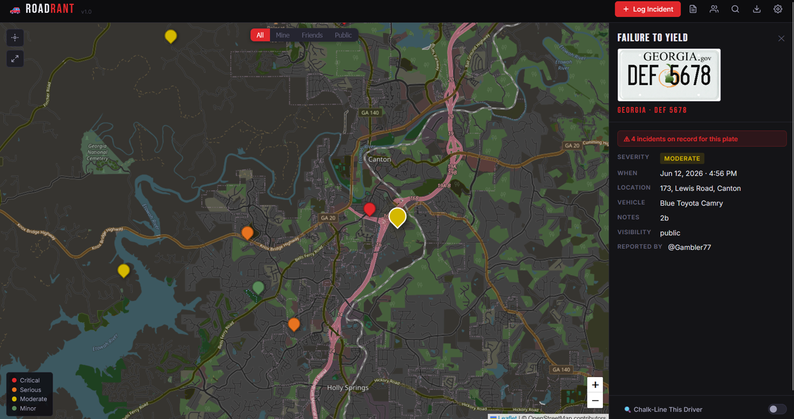

# Road Rant — Bad Driver Incident Tracker

A community-driven map app for logging and tracking bad driver incidents. Log reckless drivers by license plate, pin incidents on an interactive map, and share public reports with other users. No build tools, no npm — just static files and a Cloudflare Worker backend for storage and cross-device sync.

#### Demo:
https://badbox29.github.io/road_rant/

---

#### Screenshot


---

## Features

- **Interactive map** — Leaflet.js-powered dark map with color-coded severity pins and marker clustering
- **Severity tiers** — four levels (Critical / Serious / Moderate / Minor) with distinct colors; incidents auto-classified by type
- **Incident logging** — plate state, plate number, incident type, vehicle make/color, location, datetime, notes, and visibility per report
- **License plate renderer** — canvas-rendered state plate images with per-state fonts, colors, and positioning via `plates.json`; supports specialty plates
- **Repeat offender detection** — badge in the incident drawer showing total prior incidents for a plate across all visible users; inline warning when logging a new incident for a known plate
- **Chalk-line mode** — select a plate and see all its incidents highlighted on the map with a convex hull polygon connecting locations
- **Incident drawer** — slide-in detail panel with full incident info, plate image, severity pill, reported-by attribution, and tagged friends
- **Drawer navigation** — when opened from the incident log, prev/next arrows and a back button let you browse entries without returning to the list
- **Active pin highlight** — the map pin for the currently open drawer enlarges and pulses so you always know which incident is selected
- **Visibility controls** — per-incident visibility: Private (you only), Friends (mutual friends), or Public (all users)
- **Map visibility filter** — floating toggle to filter map pins by All / Mine / Friends / Public
- **Incident feed** — searchable, filterable list of all visible incidents with pagination; filter by severity type
- **Feed navigation** — navigate between incidents directly from the drawer with prev/next controls and a back-to-log button
- **Plate search** — search for all visible incidents by state and plate number; click any result to open its drawer; log a new incident directly from the results
- **Export** — download your incidents as JSON (full data) or CSV (spreadsheet-friendly); export button in the top bar
- **Social / Friends** — mutual friend system with request/accept/decline/cancel flow; username-based search; friend requests and acceptances delivered via KV notifications
- **Friend tagging** — tag friends by @username in incident reports; tagged users receive an alert notification
- **Alerts** — notification tab shows incoming friend requests, accepted requests, and tags; individual dismiss with KV cleanup
- **Public feed** — public incidents from all users appear on your map automatically; friends-only incidents visible to mutual friends; private incidents never shared
- **Reported by** — incident drawer shows the @username of the reporting user on all shared incidents
- **Dark mode** — full dark theme; preference persisted across sessions
- **Mobile responsive** — single-column layout on mobile; Galaxy Fold breakpoints; icon-only header on narrow screens
- **Default map location** — set a home location in Settings; map opens centered there on every load
- **Cross-device sync** — Google Sign-In or token-based KV sync via Cloudflare Worker; sign in on any device to pick up where you left off
- **Google auth** — sign in with Google for persistent identity across devices; one account per Google ID enforced
- **Token accounts** — alternative to Google auth; generate a token, copy it to any browser to sync your data
- **Token → Google migration** — one-way upgrade path from token account to Google Sign-In; all data carried forward
- **Guest mode** — try the app locally without an account; create an account any time from Settings to sync your existing data

---

## File Structure

```
road_rant/
├── index.html              # App entry point
├── css/
│   └── styles.css          # All styles
├── js/
│   ├── app.js              # All client-side logic
│   └── auth.js             # Auth module (token + Google Sign-In)
├── fonts/                  # License plate fonts
├── plates/                 # State plate PNG images
├── plates.json             # Per-state plate rendering config
├── plate_subtypes.json     # Specialty plate definitions
├── worker.js               # Cloudflare Worker (deploy separately)
└── README.md
```

---

## Setup

### 1. Get the files

Clone or download this repository. The app is entirely static — `index.html`, `css/styles.css`, `js/app.js`, and `js/auth.js` are all you need to run it locally.

Open `index.html` directly in a browser for local use, or host it on GitHub Pages (or any static host) for a permanent URL.

---

### 2. Deploy the Cloudflare Worker

The Worker handles KV storage for sync, the public/friends feed indexes, username registry, friend notifications, and plate incident indexes.

A free Cloudflare account is sufficient for personal use. The $5/month Workers Paid plan is recommended if you expect heavier usage or want higher KV read/write limits.

#### 2a. Create the Worker

1. Log in to [dash.cloudflare.com](https://dash.cloudflare.com) and open **Workers & Pages**.
2. Click **Create** → **Create Worker**.
3. Give it a name (e.g. `road-rant-worker`) and click **Deploy**.
4. Click **Edit code**, paste the entire contents of `worker.js` into the editor, and click **Deploy** again.
5. Note your Worker URL — it will look like `https://your-worker-name.your-subdomain.workers.dev`.

#### 2b. Create a KV namespace

1. In the Cloudflare dashboard, go to **Workers & Pages → KV**.
2. Click **Create a namespace**, name it (e.g. `road-rant-kv`), and click **Add**.
3. Go back to your Worker → **Settings → Bindings**.
4. Click **Add** → **KV Namespace**.
5. Set the **Variable name** to exactly `ROAD_RANT_KV` and select the namespace you just created.
6. Click **Deploy** to save the binding.

> **Why `ROAD_RANT_KV`?** The Worker references `env.ROAD_RANT_KV` by that exact name. A different variable name will break all storage routes.

#### 2c. Set environment variables

In your Worker → **Settings → Variables and Secrets**, add the following:

| Variable | Type | Value |
|---|---|---|
| `ALLOWED_ORIGINS` | Text | Comma-separated list of allowed origins (see below) |
| `GOOGLE_CLIENT_ID` | Text | Your Google OAuth Client ID (required for Google Sign-In) |

**`ALLOWED_ORIGINS` example:**
```
https://badbox29.github.io,http://localhost:3000
```

Include every URL from which you or your users will access the app. Requests from unlisted origins are rejected with `403 Forbidden`.

#### 2d. Configure Google Sign-In (optional)

Google Sign-In requires a Google OAuth Client ID. Token-based accounts work without it.

1. Go to [console.cloud.google.com](https://console.cloud.google.com) and open or create a project.
2. Navigate to **APIs & Services → Credentials** and create an **OAuth 2.0 Client ID** (Web application type).
3. Add your app's URL to **Authorized JavaScript origins** (e.g. `https://badbox29.github.io`).
4. Copy the Client ID and add it as `GOOGLE_CLIENT_ID` in your Worker environment variables.
5. Also add it to `Auth.init({ googleClientId: 'YOUR_CLIENT_ID' })` in `js/app.js`.

#### 2e. Point the app at your Worker

1. Open the app in your browser.
2. Create an account or continue as guest.
3. Open **Settings** (gear icon), paste your Worker URL into the **Worker URL** field, and save.

---

### 3. Cross-Device Sync

#### Token accounts
Your sync token is your identity in KV. Each browser generates one automatically on account creation.

- On your **primary browser**: open Settings, copy your **User Token**, and save it somewhere safe.
- On a **new browser or device**: open the app, choose **Yes — load my existing account**, enter your Worker URL and token. All your data syncs immediately.

#### Google accounts
Sign in with the same Google account on any device. Your data follows your Google identity automatically.

---

### 4. Username & Friends

1. Open **Settings** and enter a **username** (3–32 characters, letters/numbers/hyphens/underscores).
2. Click **Save** — your username is registered in KV and becomes searchable by other users.
3. Open the **Friends** panel (people icon in the header) to search for users, send friend requests, and manage your friends list.
4. Once a request is mutually accepted, each person's Friends and Public incidents appear on the other's map.

---

## Worker Routes Reference

| Method | Route | Description |
|---|---|---|
| `GET` | `/` or `/ping` | Health check (no auth required) |
| `POST` | `/auth/google` | Verify Google ID token |
| `POST` | `/auth/verify` | Re-verify stored Google credential |
| `POST` | `/auth/migrate` | Token → Google one-way migration |
| `GET` | `/storage/:token` | List all KV keys for a user token |
| `GET` | `/storage/:token/:key` | Read a KV value |
| `PUT` | `/storage/:token/:key` | Write a KV value (rebuilds feed indexes for `incidents` key) |
| `DELETE` | `/storage/:token/:key` | Delete a KV value |
| `PUT` | `/username/:username` | Register a username → token mapping |
| `GET` | `/username/:username` | Look up a token by username |
| `DELETE` | `/username/:username` | Remove a username mapping |
| `POST` | `/notify/:targetToken` | Write a notification to another user's KV space |
| `GET` | `/feed/public` | All public incidents across all users (no auth) |
| `GET` | `/feed/friends/:token` | Incidents shared with this token by their friends (auth required) |
| `GET` | `/plates/:state/:plate` | List public incidents for a plate |
| `PUT` | `/plates/:state/:plate/:id` | Index a public incident by plate |
| `DELETE` | `/plates/:state/:plate/:id` | Remove an incident from the plate index |

---

## Data Storage

All data is stored in Cloudflare KV under your user token. Nothing is stored server-side beyond what you explicitly save. There are no passwords and no data leaves your browser except through your own Worker.

`localStorage` is used as a local cache and fallback when the Worker is unreachable. KV is the source of truth when both are present.

### KV key structure

| Key pattern | Contents |
|---|---|
| `user:<token>:profile` | Username, display name, friends list, preferences |
| `user:<token>:incidents` | All incidents logged by this user |
| `user:<token>:notification/<id>` | Incoming notifications (friend requests, tags) |
| `username:<username>` | Username → token mapping |
| `token_username:<token>` | Reverse lookup: token → username |
| `feed:public` | Rolling index of all public incidents (newest 500) |
| `feed:friends:<token>` | Rolling index of friends+public incidents for this token |
| `plate:<STATE>:<PLATE>` | Public incident index by plate (newest 500) |
| `migrated:<oldToken>` | Tombstone after token → Google migration |

---

## External Services

| Service | Used For | Key Required | Notes |
|---|---|---|---|
| Google Identity Services | Google Sign-In | Yes (Client ID) | Client-side only; set in `Auth.init` and Worker env |
| Nominatim (OSM) | Address geocoding for default map location | No | Called directly from browser |
| OpenStreetMap | Map tiles via Leaflet.js | No | No key required |
| CartoDB | Dark map tile layer | No | No key required |

---

## License

See LICENSE file.
